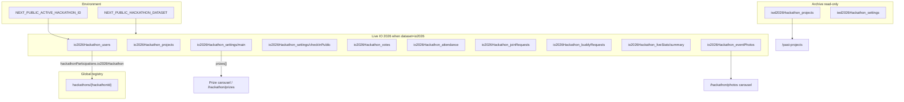
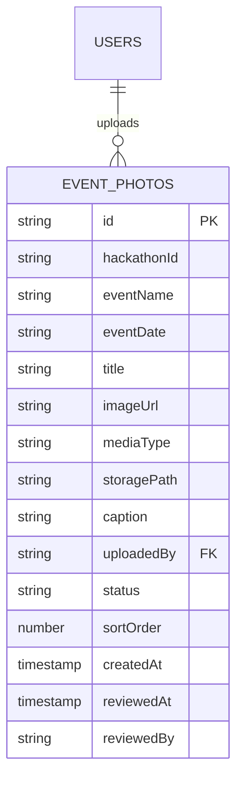

# Firestore Data Model

**GDG London Hackathon** — how collections relate across **live**, **archive**, and **registry** layers.

| Layer | Controlled by | Purpose |
|--------|----------------|---------|
| **Active dataset** | `NEXT_PUBLIC_HACKATHON_DATASET` | Which `*_users`, `*_projects`, `*_settings`, … prefix the running app reads/writes (`io2026Hackathon_*` vs legacy `hackaton*`). |
| **Hackathon registry** | `hackathons` collection | Metadata for each edition (display name, slug, which dataset family it used). |
| **User participation** | `hackathonParticipations` on user doc | Which registry ids a user has joined (independent of switching dataset env). |
| **Archive** | `iwd2026Hackathon_*` | Read-only past IWD 2026 data (`/past-projects`). |

Code: `lib/hackathon-collections.ts`, `lib/constants.ts`, `lib/active-hackathon.ts`, `lib/participation.ts`, `lib/hackathons-registry.ts`, `lib/prizes.ts`.

---

## Collection map (conceptual)



---

## Global collections (not dataset-prefixed)

### `hackathons` — edition registry

| Field | Type | Notes |
|-------|------|--------|
| `slug` | string | URL-friendly label |
| `displayName` | string | Shown in admin |
| `description` | string | Optional |
| `dataCollectionKey` | `"io2026"` \| `"legacy"` | Documents which collection **family** this edition used; does **not** switch the app (env does). |
| `createdAt`, `updatedAt`, `createdBy` | audit | |

**Rules:** read all; create/update/delete admin only.

**Admin UI:** `/admin/hackathons` — create/update registry rows; **Seed IO 2026 prizes** writes to active `settings/main`.

**Default IO edition id:** `io2026Hackathon` (see `getActiveHackathonId()`).

---

## Active dataset collections

When `NEXT_PUBLIC_HACKATHON_DATASET=io2026`, the app uses `io2026Hackathon_*`. When unset, legacy `hackaton*` (and parallel `hackatonVotes`, etc.).

| Purpose | IO 2026 (`io2026`) | Legacy (`hackaton*`) |
|---------|-------------------|----------------------|
| Users | `io2026Hackathon_users` | `hackatonUsers` |
| Projects | `io2026Hackathon_projects` | `hackatonProjects` |
| Join requests | `io2026Hackathon_joinRequests` | `hackatonJoinRequests` |
| Settings | `io2026Hackathon_settings` / doc **`main`** | `hackatonConfig` / doc **`settings`** |
| Buddy requests | `io2026Hackathon_buddyRequests` | `hackatonBuddyRequests` |
| Votes | `io2026Hackathon_votes` | `hackatonVotes` |
| Attendance | `io2026Hackathon_attendance` | `hackatonAttendance` |
| Winners | `io2026Hackathon_winners` | `hackatonWinners` |
| Discussions | `io2026Hackathon_discussions` | `hackatonDiscussions` |
| Updates | `io2026Hackathon_updates` | `hackatonUpdates` |
| Credit claims | `io2026Hackathon_creditClaims` | `hackatonCreditClaims` |
| Event photos | `io2026Hackathon_eventPhotos` | — |

Subcollections (under projects / users): `comments`, `bookmarks` — see `lib/constants.ts`.

### Event gallery media (`io2026Hackathon_eventPhotos`)

Photos and short videos for the public carousel at `/hackathon/photos`. Collection name is historical (`eventPhotos`); UI copy uses **Event gallery**.



| Field | Type | Notes |
|-------|------|--------|
| `hackathonId` | string | Edition id (e.g. `io2026Hackathon`) |
| `eventName` | string | Filter label in gallery UI (max 120) |
| `eventDate` | string | Filter label, ISO `YYYY-MM-DD` |
| `title` | string? | **Display name** (rename in UI); carousel heading |
| `imageUrl` | string | Public download URL — image **or** video |
| `mediaType` | `"image"` \| `"video"` | Default `image` when omitted on legacy docs |
| `storagePath` | string | Firebase Storage object path |
| `caption` | string? | Optional description (max 300) |
| `uploadedBy` | string | Firebase Auth UID |
| `status` | `"pending"` \| `"approved"` \| `"rejected"` | See flows below |
| `sortOrder` | number? | Carousel order (lower = earlier); set in admin gallery editor |
| `createdAt` | timestamp | Upload time |
| `reviewedAt`, `reviewedBy` | timestamp / string | Set when approved (or on admin immediate publish) |

**Status semantics**

| `status` | Visible on public `/hackathon/photos` | Who can create |
|----------|--------------------------------------|----------------|
| `pending` | No | Attendee (via callables) |
| `approved` | Yes | Admin direct create, or admin approves pending |
| `rejected` | No | N/A (doc usually deleted) |

**Quota:** max **10** items per attendee (`MAX_EVENT_PHOTOS_PER_ATTENDEE` in `lib/constants.ts`) — pending + approved combined. Enforced in **`reserveEventPhotoUpload`** transaction (not client-only).

**File limits (client + Storage rules)**

| Type | Max size | MIME types |
|------|----------|------------|
| Image | 10 MB | JPEG, PNG, GIF, WebP |
| Video | 50 MB | MP4, WebM, QuickTime (MOV) |

**Storage paths**

| Uploader | Path pattern | Rules |
|----------|--------------|--------|
| Attendee | `event_photos/{hackathonId}/{uid}/{photoId}` | Write only if matching **pending** Firestore doc exists |
| Admin | `event_photos/{hackathonId}/{fileName}` | `isStorageAdmin()` + media size/type checks |

**Firestore rules (summary)**

- **Read:** `approved` for everyone; own docs for owner; all for admin.
- **Create (client):** admin only, `status == approved`.
- **Create (attendee):** `reserveEventPhotoUpload` + `finalizeEventPhotoUpload` callables only.
- **Update:** admin only (metadata, `sortOrder`, approve).
- **Delete:** `withdrawEventPhoto` callable (admin any; attendee pending only) or rules-backed pending delete.

**Cloud Functions (codebase `hackathon`)**

| Callable | Purpose |
|----------|---------|
| `reserveEventPhotoUpload` | Transaction: count &lt; 10 → create pending doc + `storagePath` |
| `finalizeEventPhotoUpload` | Set `imageUrl` after Storage upload |
| `withdrawEventPhoto` | Delete Storage + doc; frees attendee slot |

Deploy example:

```bash
firebase deploy --only functions:hackathon:reserveEventPhotoUpload,functions:hackathon:finalizeEventPhotoUpload,functions:hackathon:withdrawEventPhoto,firestore:rules,storage
```

**Application modules:** `lib/event-photos.ts`, `types/event-photo.ts`, `components/photos/*`, `components/admin/AdminEventPhotosPanel.tsx`, `components/admin/EventPhotoGalleryEditor.tsx`.

---

## Archive dataset (`iwd2026Hackathon_*`)

Populated by `npm run migrate:iwd-archive` from legacy `hackaton*`. **Client read-only** in Firestore rules; writes via Admin SDK / migration only.

Used by **`/past-projects`**: winners + stats (`HackathonResultsSummary`) and project cards.

| Collection | Notes |
|------------|--------|
| `iwd2026Hackathon_projects` | Includes `place`, `status`, `fullName`, team fields |
| `iwd2026Hackathon_settings` | Optional; winners flags |
| `iwd2026Hackathon_users` | Archived profiles |
| … | Same shape as live family (see `IWD2026_COLLECTIONS` in `lib/hackathon-collections.ts`) |

---

## User profiles (active `users` collection)

Document ID = Firebase Auth UID.

**Creation paths:**

| Path | When | Module / Function |
|------|------|-------------------|
| Self sign-in | User registers or signs in | `lib/user-profile-sync.ts` → `syncUserProfileOnAuth`; backup `ensureUserProfile` callable |
| Admin provision | Admin adds email before/without full profile | `adminProvisionHackathonUser` callable via `/admin/users` |

```typescript
{
  uid: string;
  email: string | null;
  displayName: string | null;
  role: "admin" | "moderator" | "user";
  createdAt: Timestamp;
  updatedAt: Timestamp;

  // Audit (admin provision + server writes)
  createdBy?: string;      // admin uid when provisioned; else often self uid
  updatedBy?: string;
  createdDate?: Timestamp;
  updatedDate?: Timestamp;

  // Admin-provisioned placeholder profile (until user signs in)
  adminProvisioned?: boolean;
  profileStatus?: "provisioned" | "active";
  provisionedBy?: string;   // admin uid
  provisionedAt?: Timestamp;
  migratedFromLegacyAt?: Timestamp;  // if copied from hackatonUsers
  migratedFrom?: string;

  // Hackathon profile (Buddies / directory / join requests)
  hackathonBio?: string;
  hackathonLinkedinUrl?: string;
  profileDisplayName?: string;
  city?: string;
  country?: string;
  experienceLevel?: "beginner" | "intermediate" | "advanced";
  programmingSkills?: string[];
  domainExpertise?: string[];
  wantToLearnTags?: string[];
  canOfferTags?: string[];
  githubUrl?: string;
  websiteUrl?: string;
  buddiesVisibleInDirectory?: boolean;
  skills?: string[];
  interests?: string[];
  teamPreference?: string;
  inPersonAttendance?: boolean | null;
  profileCompletionPercent?: number;

  // Multi-hackathon participation (registry ids, not collection prefixes)
  hackathonParticipations?: {
    [hackathonId: string]: { joinedAt?: Timestamp };
  };
}
```

**Participation:** On profile load, `recordHackathonParticipationIfNeeded(uid)` merges `hackathonParticipations.{NEXT_PUBLIC_ACTIVE_HACKATHON_ID}` (default `io2026Hackathon`) if missing. **Admin users** list shows participation keys.

**To set admin:** Firestore Console → active **users** collection → `role: "admin"` (in `io2026Hackathon_users` and/or legacy `hackatonUsers` if both exist).

**Admin profile edits:** use Cloud Functions `adminUpdateUser`, `setUserRole`, `adminSetUserDeleted` — not raw client `updateDoc` on another user’s document.

**Admin add to hackathon:** `adminProvisionHackathonUser` — email must exist in Firebase Auth; merges `hackathonParticipations.{ACTIVE_HACKATHON_ID}`; sets audit fields; copies legacy `hackatonUsers` fields when present. UI: `components/admin/AdminProvisionUserDialog.tsx`, logic: `lib/admin-users.ts`.

---

## Settings document (`settings/main` or legacy `settings`)

Active path from `SETTINGS_COLLECTION` + `SETTINGS_DOC_ID` in `lib/constants.ts`.

```typescript
{
  winnersAnnounced?: boolean;
  winnersAnnouncedAt?: Timestamp;
  winnersAnnouncedBy?: string;
  hackathonId?: string;

  // Prize pool (IO 2026) — carousel + /hackathon/prizes
  prizes?: {
    id: string;
    name: string;
    imageSrc: string;   // public path e.g. /Sony_wireless_headphones.png
    featured?: boolean;
    sortOrder: number;
  }[];
  prizesUpdatedAt?: Timestamp;
  prizesUpdatedBy?: string;

  votingOpensAt?: Timestamp;
  votingClosesAt?: Timestamp;

  judgingCriteria?: { title: string; description: string }[];
}
```

**Related settings documents** (same `io2026Hackathon_settings` collection):

| Doc ID | Read access | Purpose |
|--------|-------------|---------|
| `main` | Public | Prizes, voting window, winners flag, rules CMS fields, judging criteria |
| `checkInPublic` | Public | Check-in window open/close timestamps (no secret code) |
| `checkInSecrets` | **Admin SDK / Functions only** | Hashed 6-digit desk code; never exposed to client rules |
| `liveSlide` | Public | Projector mode (`leaderboard` \| `pitch` \| `welcome`), headlines, `currentPitchProjectId` |

**Seed:** Admin → Hackathons → “Seed IO 2026 prizes”, or `npm run seed:io2026 -- --uid=... --force-settings` (also merges default **judging criteria**).

**Defaults:** `lib/prizes.ts` → `DEFAULT_IO2026_PRIZES` (Sony headphones, wireless keyboard, bag, Google socks).

---

## Project submissions (active `projects` collection)

**IO 2026 collection:** `io2026Hackathon_projects` (auto-created on first save).

**Write path:** `lib/project-submissions.ts` → `saveProjectDocument` (client SDK). Every document includes **`userId`**, **`userEmail`**, **`hackathonId`** (registry id, e.g. `io2026Hackathon`), **`hackathonName`**. Firestore rules require `hackathonId` on create/update.

**Load path:** `findUserProjectForActiveHackathon(uid)` — query `userId` + `hackathonId`; legacy rows without `hackathonId` are upgraded on next save.

```typescript
{
  projectTitle?: string;
  teamName?: string;
  projectType?: "solo" | "team";
  teamMembers?: { name: string; linkedinUrl?: string }[];
  appPurpose: string;
  demoVideoUrl?: string;
  githubUrl: string;
  fullName: string;
  email: string;
  userId: string;
  userEmail: string;
  createdAt: Timestamp;
  status?: "draft" | "submitted" | "finalist" | "winner";

  builtWith?: string[];
  aiCategory?: string;
  screenshots?: string[];
  lookingForMembers?: boolean;
  label?: "winner" | "finalist" | "featured";
  place?: "first" | "second" | "third";
  hackathonId: string;    // required — e.g. io2026Hackathon (rules + stampProjectOwnership)
  hackathonName: string;  // display label, e.g. GDG London Hackathon
  voteTotal?: number;     // audience aggregate; only Functions may change

  likes?: number;
  views?: number;
  likesBy?: string[];
  commentCount?: number;

  // Audit
  createdBy?: string;
  updatedBy?: string;
  createdDate?: Timestamp;
  updatedDate?: Timestamp;
}
```

**Winners UI:** Admin dashboard and `/past-projects` use `place` + `fullName` (or team fallbacks) via `components/HackathonResultsSummary.tsx`. Primary path for IO 2026: **total votes** → admin **`assignWinnersFromVotes`** or manual `place`.

---

## Audience voting

**Collection:** `io2026Hackathon_votes` (doc id `{hackathonId}_{userId}_{projectId}`)

```typescript
{
  userId: string;
  projectId: string;
  hackathonId: string;       // e.g. io2026Hackathon
  voteCount: number;         // 1 or 2 (max per project)
  attendanceVerified: boolean;
  userName?: string;
  timestamp: Timestamp;
}
```

**Rules:** users read own votes; **no client writes** — `castVotes` Cloud Function only.

**Caps (server):** organisers (`admin` \| `moderator`) **10** total; participants **5**; **max 2** per project; no self-vote; requires attendance doc.

**Attendance:** `io2026Hackathon_attendance/{userId}` with `attendanceVerified: true` (see `/checkin`).

**Client:** `lib/voting.ts`, UI `/vote`, admin `/admin/voting`.

**Indexes** (`firestore.indexes.json`):

| Collection | Fields | Used by |
|------------|--------|---------|
| `io2026Hackathon_votes` | `userId` ASC, `hackathonId` ASC | `fetchUserVotes`, `castVotes` |
| `io2026Hackathon_projects` | `status` ASC, `voteTotal` DESC | `fetchVoteableProjects` (fallback query if index missing) |

**Client resilience:** `fetchUserVotes` tries the composite query first; on `failed-precondition` (index building/missing), falls back to `userId` only and filters `hackathonId` in memory.

**Vote page load:** projects + settings load independently of ballot/attendance so a ballot query failure does not blank the project list.

---

## Event attendance & swag

**Collection:** `io2026Hackathon_attendance` — **document ID = Firebase Auth `uid`** (one row per attendee).

```typescript
{
  userId: string;                    // same as doc id
  checkedInAt: Timestamp;
  checkedInByUid: string;            // self uid or organiser uid
  method: "self" | "admin" | "staff";
  attendanceVerified: true;          // required for voting

  /** AI DevCamp 2026 cohort — set at staff desk */
  cohort?: "aidevcamp2026" | "aidevcamp_flat" | null;
  // Legacy aidevcamp_flat is normalized to aidevcamp2026 on new staff writes

  swagReceived?: boolean;
  swagReceivedAt?: Timestamp;
  swagReceivedByUid?: string;        // organiser who marked swag
}
```

**Rules:** users read **own** doc; organisers read any; **no client create/update** — writes via API routes and Cloud Functions only.

**Write paths:**

| Action | Path | Who |
|--------|------|-----|
| Self check-in | `POST /api/me/attendance/self-check-in` | Participant (validates 6-digit code + window) |
| Staff check-in | `staffCheckInUser` callable | `admin` / `moderator` |
| Tag AI DevCamp | `staffCheckInUser` with `cohort: "aidevcamp2026"` or `tagAttendeeAidevcamp2026()` | Organiser desk |
| Swag | `setAttendeeSwag` callable | Organiser (requires prior check-in) |
| Reset | `resetUserAttendance` callable | Admin only |

**UI surfaces:**

| Surface | Shows |
|---------|--------|
| `/checkin` | Self code entry; organiser desk (`StaffAttendeeCheckIn`) |
| `/vote` | `AttendeeEventBadges` — **AI DevCamp 2026 attendee**, **Swag received** when applicable |
| Admin → **Check-in desk** (`/checkin` from admin nav) | Filters: Not checked in, Needs swag, AI DevCamp; one-tap swag + cohort tag |

**Cohort helper:** `isAidevcampCohort(cohort)` in `lib/attendance.ts` — treats `aidevcamp2026` and legacy `aidevcamp_flat` as the same badge.

---

## Live projector (§9)

**Aggregates:** `io2026Hackathon_liveStats/summary` — `checkInCount`, `totalVotesCast`, `topProjects[]`, `updatedAt`. Rebuilt by Cloud Function after votes and via `refreshLiveStats` (admin).

**Slide:** `io2026Hackathon_settings/liveSlide` — `mode` (`leaderboard` \| `pitch` \| `welcome`), `headline`, `subheadline`, `currentPitchProjectId`, `showTopN`. Admin write; public read.

**UI:** `/live` (subscribe only); `/admin/live` (controls).

---

## Hackathon content CMS (`settings/main`)

Editable per active hackathon (IO 2026 uses `io2026Hackathon_settings/main`):

| Field | Purpose |
|-------|---------|
| `resourcesIntro` | Hero blurb on `/hackathon/resources` |
| `resourceLinks[]` | Learning link buttons |
| `discordUrl` | Discord CTA |
| `rulesTitle` | Rules heading |
| `rulesSections[]` | Structured cards/lists (`kind`, `title`, `body`, `items`, …) |
| `judgingCriteria[]` | Bullets under judging section |

**Admin:** `/admin/content` · **Defaults:** `lib/hackathon-content-defaults.ts` · **Seed:** `npm run seed:io2026 -- --force-settings` or “Seed defaults” in admin.

---

## Storage

| Purpose | Path |
|---------|------|
| Project uploads | `hackathon_uploads/` (see `FIREBASE_STORAGE_FOLDER` in `lib/constants.ts`) |

---

## Environment variables (data-related)

| Variable | Effect |
|----------|--------|
| `NEXT_PUBLIC_HACKATHON_DATASET=io2026` | Active collections = `io2026Hackathon_*` |
| *(unset)* | Active collections = legacy `hackaton*` |
| `NEXT_PUBLIC_ACTIVE_HACKATHON_ID` | Registry id written to `hackathonParticipations` (default `io2026Hackathon`) |
| `NEXT_PUBLIC_APP_URL` | Optional; password-reset email return URL base |

---

## Migration & seed scripts

| Script | Purpose |
|--------|---------|
| `npm run migrate:iwd-archive` | Legacy `hackaton*` → `iwd2026Hackathon_*` (archive) |
| `npm run seed:io2026 -- --uid=...` | Admin user → `io2026Hackathon_users`; settings defaults + **prizes**; optional `--with-registry` for `hackathons/io2026Hackathon` |

---

## Related docs

- [IO2026_HACKATHON_SPEC.md](./IO2026_HACKATHON_SPEC.md) — rollout, routes, voting roadmap
- [USER_FLOW.md](./USER_FLOW.md) — sign-in, register, participation journey
- [FIRESTORE_RULES.md](./FIRESTORE_RULES.md) — security rules
- [ARCHITECTURE.md](./ARCHITECTURE.md) — code boundaries
