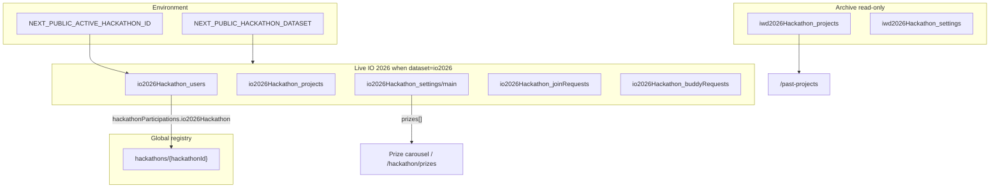

# Firestore Data Model

**GDG London Hackathon** — how collections relate across **live**, **archive**, and **registry** layers.

| Layer | Controlled by | Purpose |
|--------|----------------|---------|
| **Active dataset** | `NEXT_PUBLIC_HACKATHON_DATASET` | Which `*_users`, `*_projects`, `*_settings`, … prefix the running app reads/writes (`io2026Hackathon_*` vs legacy `hackaton*`). |
| **Hackathon registry** | `hackathons` collection | Metadata for each edition (display name, slug, which dataset family it used). |
| **User participation** | `hackathonParticipations` on user doc | Which registry ids a user has joined (independent of switching dataset env). |
| **Archive** | `iwd2026Hackathon_*` | Read-only past IWD 2026 data (`/past-projects`). |

Code: `lib/hackathon-collections.ts`, `lib/constants.ts`, `lib/active-hackathon.ts`, `lib/participation.ts`, `lib/hackathons-registry.ts`, `lib/prizes.ts`.

---

## Collection map (conceptual)



---

## Global collections (not dataset-prefixed)

### `hackathons` — edition registry

| Field | Type | Notes |
|-------|------|--------|
| `slug` | string | URL-friendly label |
| `displayName` | string | Shown in admin |
| `description` | string | Optional |
| `dataCollectionKey` | `"io2026"` \| `"legacy"` | Documents which collection **family** this edition used; does **not** switch the app (env does). |
| `createdAt`, `updatedAt`, `createdBy` | audit | |

**Rules:** read all; create/update/delete admin only.

**Admin UI:** `/admin/hackathons` — create/update registry rows; **Seed IO 2026 prizes** writes to active `settings/main`.

**Default IO edition id:** `io2026Hackathon` (see `getActiveHackathonId()`).

---

## Active dataset collections

When `NEXT_PUBLIC_HACKATHON_DATASET=io2026`, the app uses `io2026Hackathon_*`. When unset, legacy `hackaton*` (and parallel `hackatonVotes`, etc.).

| Purpose | IO 2026 (`io2026`) | Legacy (`hackaton*`) |
|---------|-------------------|----------------------|
| Users | `io2026Hackathon_users` | `hackatonUsers` |
| Projects | `io2026Hackathon_projects` | `hackatonProjects` |
| Join requests | `io2026Hackathon_joinRequests` | `hackatonJoinRequests` |
| Settings | `io2026Hackathon_settings` / doc **`main`** | `hackatonConfig` / doc **`settings`** |
| Buddy requests | `io2026Hackathon_buddyRequests` | `hackatonBuddyRequests` |
| Votes | `io2026Hackathon_votes` | `hackatonVotes` |
| Attendance | `io2026Hackathon_attendance` | `hackatonAttendance` |
| Winners | `io2026Hackathon_winners` | `hackatonWinners` |
| Discussions | `io2026Hackathon_discussions` | `hackatonDiscussions` |
| Updates | `io2026Hackathon_updates` | `hackatonUpdates` |
| Credit claims | `io2026Hackathon_creditClaims` | `hackatonCreditClaims` |

Subcollections (under projects / users): `comments`, `bookmarks` — see `lib/constants.ts`.

---

## Archive dataset (`iwd2026Hackathon_*`)

Populated by `npm run migrate:iwd-archive` from legacy `hackaton*`. **Client read-only** in Firestore rules; writes via Admin SDK / migration only.

Used by **`/past-projects`**: winners + stats (`HackathonResultsSummary`) and project cards.

| Collection | Notes |
|------------|--------|
| `iwd2026Hackathon_projects` | Includes `place`, `status`, `fullName`, team fields |
| `iwd2026Hackathon_settings` | Optional; winners flags |
| `iwd2026Hackathon_users` | Archived profiles |
| … | Same shape as live family (see `IWD2026_COLLECTIONS` in `lib/hackathon-collections.ts`) |

---

## User profiles (active `users` collection)

Document ID = Firebase Auth UID. Created/updated on sign-in via `lib/auth.ts` → `createOrUpdateUserProfile`.

```typescript
{
  uid: string;
  email: string | null;
  displayName: string | null;
  role: "admin" | "moderator" | "user";
  createdAt: Timestamp;
  updatedAt: Timestamp;

  // Hackathon profile (Buddies / directory / join requests)
  hackathonBio?: string;
  hackathonLinkedinUrl?: string;
  profileDisplayName?: string;
  city?: string;
  country?: string;
  experienceLevel?: "beginner" | "intermediate" | "advanced";
  programmingSkills?: string[];
  domainExpertise?: string[];
  wantToLearnTags?: string[];
  canOfferTags?: string[];
  githubUrl?: string;
  websiteUrl?: string;
  buddiesVisibleInDirectory?: boolean;
  skills?: string[];
  interests?: string[];
  teamPreference?: string;
  inPersonAttendance?: boolean | null;
  profileCompletionPercent?: number;

  // Multi-hackathon participation (registry ids, not collection prefixes)
  hackathonParticipations?: {
    [hackathonId: string]: { joinedAt?: Timestamp };
  };
}
```

**Participation:** On profile load, `recordHackathonParticipationIfNeeded(uid)` merges `hackathonParticipations.{NEXT_PUBLIC_ACTIVE_HACKATHON_ID}` (default `io2026Hackathon`) if missing. **Admin users** list shows participation keys.

**To set admin:** Firestore Console → active **users** collection → `role: "admin"`.

---

## Settings document (`settings/main` or legacy `settings`)

Active path from `SETTINGS_COLLECTION` + `SETTINGS_DOC_ID` in `lib/constants.ts`.

```typescript
{
  winnersAnnounced?: boolean;
  winnersAnnouncedAt?: Timestamp;
  winnersAnnouncedBy?: string;
  hackathonId?: string;

  // Prize pool (IO 2026) — carousel + /hackathon/prizes
  prizes?: {
    id: string;
    name: string;
    imageSrc: string;   // public path e.g. /Sony_wireless_headphones.png
    featured?: boolean;
    sortOrder: number;
  }[];
  prizesUpdatedAt?: Timestamp;
  prizesUpdatedBy?: string;

  votingOpensAt?: Timestamp;
  votingClosesAt?: Timestamp;

  judgingCriteria?: { title: string; description: string }[];
}
```

**Seed:** Admin → Hackathons → “Seed IO 2026 prizes”, or `npm run seed:io2026 -- --uid=... --force-settings` (also merges default **judging criteria**).

**Defaults:** `lib/prizes.ts` → `DEFAULT_IO2026_PRIZES` (Sony headphones, wireless keyboard, bag, Google socks).

---

## Project submissions (active `projects` collection)

```typescript
{
  projectTitle?: string;
  teamName?: string;
  projectType?: "solo" | "team";
  teamMembers?: { name: string; linkedinUrl?: string }[];
  appPurpose: string;
  demoVideoUrl?: string;
  githubUrl: string;
  fullName: string;
  email: string;
  userId: string;
  userEmail: string;
  createdAt: Timestamp;
  status?: "draft" | "submitted" | "finalist" | "winner";

  builtWith?: string[];
  aiCategory?: string;
  screenshots?: string[];
  lookingForMembers?: boolean;
  label?: "winner" | "finalist" | "featured";
  place?: "first" | "second" | "third";
  hackathonId?: string;   // registry id, e.g. io2026Hackathon — set on createProject
  voteTotal?: number;     // audience aggregate; only Functions may change

  likes?: number;
  views?: number;
  likesBy?: string[];
  commentCount?: number;

  // Audit
  createdBy?: string;
  updatedBy?: string;
  createdDate?: Timestamp;
  updatedDate?: Timestamp;
}
```

**Winners UI:** Admin dashboard and `/past-projects` use `place` + `fullName` (or team fallbacks) via `components/HackathonResultsSummary.tsx`. Primary path for IO 2026: **total votes** → admin **`assignWinnersFromVotes`** or manual `place`.

---

## Audience voting

**Collection:** `io2026Hackathon_votes` (doc id `{hackathonId}_{userId}_{projectId}`)

```typescript
{
  userId: string;
  projectId: string;
  hackathonId: string;       // e.g. io2026Hackathon
  voteCount: number;         // 1 or 2 (max per project)
  attendanceVerified: boolean;
  userName?: string;
  timestamp: Timestamp;
}
```

**Rules:** users read own votes; **no client writes** — `castVotes` Cloud Function only.

**Caps (server):** organisers (`admin` \| `moderator`) **10** total; participants **5**; **max 2** per project; no self-vote; requires attendance doc.

**Attendance:** `io2026Hackathon_attendance/{userId}` with `attendanceVerified: true` (see `/checkin`).

**Client:** `lib/voting.ts`, UI `/vote`, admin `/admin/voting`.

---

## Live projector (§9)

**Aggregates:** `io2026Hackathon_liveStats/summary` — `checkInCount`, `totalVotesCast`, `topProjects[]`, `updatedAt`. Rebuilt by Cloud Function after votes and via `refreshLiveStats` (admin).

**Slide:** `io2026Hackathon_settings/liveSlide` — `mode` (`leaderboard` \| `pitch` \| `welcome`), `headline`, `subheadline`, `currentPitchProjectId`, `showTopN`. Admin write; public read.

**UI:** `/live` (subscribe only); `/admin/live` (controls).

---

## Hackathon content CMS (`settings/main`)

Editable per active hackathon (IO 2026 uses `io2026Hackathon_settings/main`):

| Field | Purpose |
|-------|---------|
| `resourcesIntro` | Hero blurb on `/hackathon/resources` |
| `resourceLinks[]` | Learning link buttons |
| `discordUrl` | Discord CTA |
| `rulesTitle` | Rules heading |
| `rulesSections[]` | Structured cards/lists (`kind`, `title`, `body`, `items`, …) |
| `judgingCriteria[]` | Bullets under judging section |

**Admin:** `/admin/content` · **Defaults:** `lib/hackathon-content-defaults.ts` · **Seed:** `npm run seed:io2026 -- --force-settings` or “Seed defaults” in admin.

---

## Storage

| Purpose | Path |
|---------|------|
| Project uploads | `hackathon_uploads/` (see `FIREBASE_STORAGE_FOLDER` in `lib/constants.ts`) |

---

## Environment variables (data-related)

| Variable | Effect |
|----------|--------|
| `NEXT_PUBLIC_HACKATHON_DATASET=io2026` | Active collections = `io2026Hackathon_*` |
| *(unset)* | Active collections = legacy `hackaton*` |
| `NEXT_PUBLIC_ACTIVE_HACKATHON_ID` | Registry id written to `hackathonParticipations` (default `io2026Hackathon`) |
| `NEXT_PUBLIC_APP_URL` | Optional; password-reset email return URL base |

---

## Migration & seed scripts

| Script | Purpose |
|--------|---------|
| `npm run migrate:iwd-archive` | Legacy `hackaton*` → `iwd2026Hackathon_*` (archive) |
| `npm run seed:io2026 -- --uid=...` | Admin user → `io2026Hackathon_users`; settings defaults + **prizes**; optional `--with-registry` for `hackathons/io2026Hackathon` |

---

## Related docs

- [IO2026_HACKATHON_SPEC.md](./IO2026_HACKATHON_SPEC.md) — rollout, routes, voting roadmap
- [USER_FLOW.md](./USER_FLOW.md) — sign-in, register, participation journey
- [FIRESTORE_RULES.md](./FIRESTORE_RULES.md) — security rules
- [ARCHITECTURE.md](./ARCHITECTURE.md) — code boundaries
