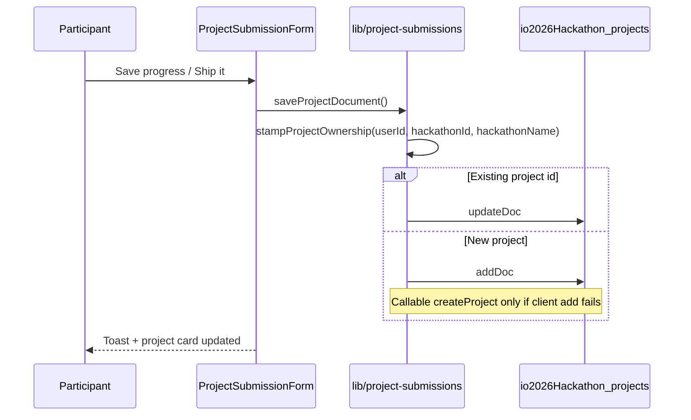
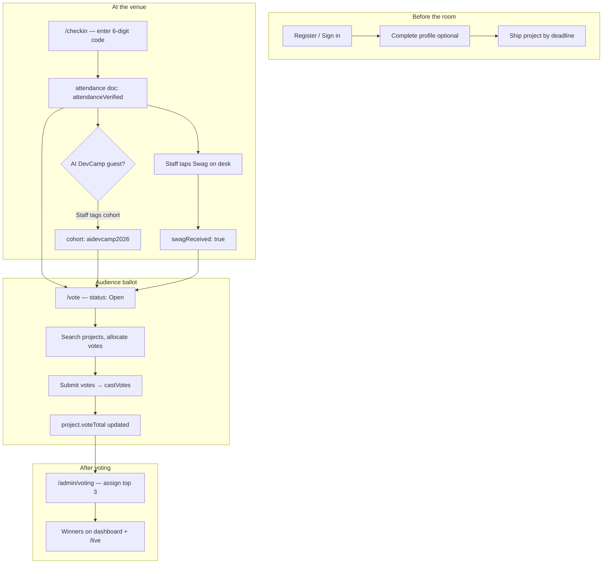
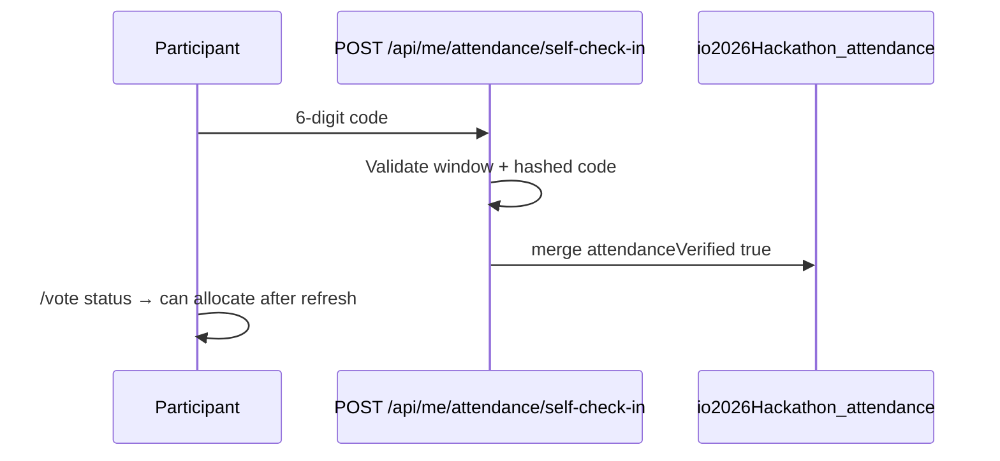
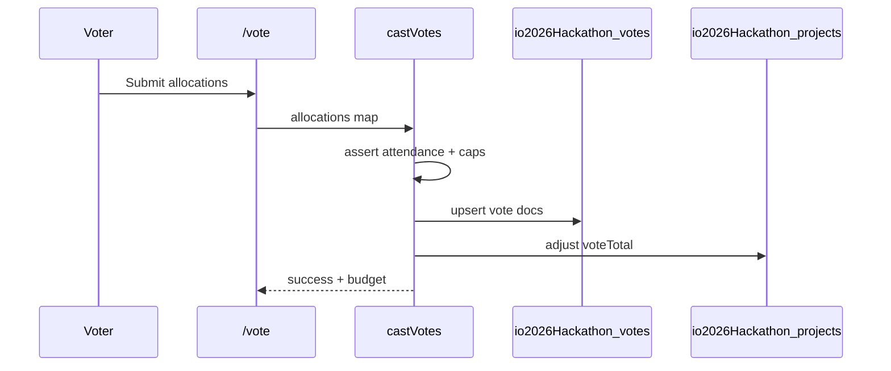

# User Flow — GDG London Hackathon

Participant journey from landing through auth, profile, projects, event day, and past editions.

---

## Overview

```
┌──────────────────────────────────────────────────────────────────────────────────┐
│                              PARTICIPANT JOURNEY                                  │
├──────────────────────────────────────────────────────────────────────────────────┤
│                                                                                   │
│   1. DISCOVER              2. AUTH                     3. PARTICIPATE             │
│   ───────────              ─────                     ──────────────             │
│   /hackathon               /register (sign up)         Profile (directory)      │
│   Prizes, timeline         /hackathon?login=1          My project (save / ship)   │
│                            AuthModal (sign in)         Ideas · Gallery · Buddies  │
│                                                                                   │
│   4. EVENT DAY             5. PAST EDITIONS                                       │
│   ────────────             ────────────────                                       │
│   /checkin → /vote         /past-projects (IWD archive)                           │
│                                                                                   │
└──────────────────────────────────────────────────────────────────────────────────┘
```

**Canonical project UX:** draft and final submission live on **`/hackathon/my-projects`**, not on the profile page. Profile is for directory / buddies settings only.

---

## Step 1: Overview

**Route:** `/hackathon`

**What the user sees:**
- Hero, timeline, prize carousel (from Firestore `settings/main.prizes` or defaults)
- CTAs: my project, browse ideas, gallery
- **Sign in** / **Register** in the app bar (guests)

**Not signed in:** gated actions open sign-in or link to `/register`.

---

## Step 2: Sign in or register

Aligned with [AI DevCamp Build with AI](https://github.com/sumithpdd/AI_DevCamp_BuildwithAI) auth UX.

### Sign in

| Entry | Behaviour |
|-------|-----------|
| App bar **Sign in** | Opens sign-in modal (`HackathonAuthShell` + `AuthModal`) |
| Protected route while guest | Redirect to `?login=1&redirect=<path>` |
| `/hackathon?login=1` | Opens modal on load (query stripped from URL) |
| `/hackathon?login=1&reset=1` | Modal in **forgot password** mode |
| `/hackathon?login=1&redirect=/hackathon/ideas` | After success → redirect path |

**Modal (`components/AuthModal.tsx`):**
- **Continue with Google** — popup on desktop; **redirect** on mobile / iOS (avoids popup blockers)
- Email + password
- **Forgot password?** → reset email via Firebase
- Link to **Register** → `/register`

**Libraries:** `lib/auth.ts`, `lib/auth-redirect.ts`, `lib/googleRedirectResult.ts`, `lib/firebaseAuthErrors.ts`.

### Register

**Route:** `/register`

- Dedicated page: Google + name / email / password
- After success → **`/hackathon/profile`**
- Footer: **Sign in** → `/hackathon?login=1`, **Forgot password?** → `/hackathon?login=1&reset=1`

### After authentication

1. Firebase Auth session established
2. `createOrUpdateUserProfile` writes/merges active **`users`** doc (`io2026Hackathon_users` when `NEXT_PUBLIC_HACKATHON_DATASET=io2026`)
3. `recordHackathonParticipationIfNeeded` merges **`hackathonParticipations.{activeHackathonId}`** (default `io2026Hackathon`)
4. Header shows profile, buddies, my projects, sign out

**Recommended next step:** complete **`/hackathon/profile`** before **Request to join** on **`/hackathon/ideas`** (80% team-join score).

---

## Step 3: Participate

### Option A: Hackathon profile (directory & buddies)

**Route:** `/hackathon/profile` (`/profile` redirects here)

Bio, location, tags, Buddies directory opt-in, in-person attendance — used by **`isHackathonProfileComplete`** for idea gallery join requests.

**Not used for:** project draft/final form (see Option C).

### Option B: Idea gallery — request to join

**Route:** `/hackathon/ideas` (`/ideas` redirects)

- Projects with **looking for members** for the **active** `hackathonId` only (`lib/hackathon-projects.ts`)
- **Request to join** requires **≥ 80%** team join score — see `lib/profile-completion.ts`
- Guests: **Sign in to Request to Join** → opens sign-in with redirect
- Past ideas and winners: **`/past-projects`** (IWD 2026 archive)

### Option C: Create / save / ship project

**Route:** `/hackathon/my-projects` (`?project=1`, `&edit=<id>`)

| Action | Button | `status` in Firestore | When |
|--------|--------|----------------------|------|
| Save work in progress | **Save progress** | `draft` (or stays `submitted` if already shipped) | Any time inside submission window |
| Final hand-in | **Ship it! — Final submission** | `submitted` | After required fields validate; before deadline |

**Redirects:** `/submit`, `/ideas/create` → `/hackathon/my-projects?project=1`

**Timeline gates:** `HACKATHON_IDEA_SUBMISSION_OPENS`, `HACKATHON_SUBMISSION_DEADLINE` (`lib/constants.ts`, `lib/hackathon-timeline.ts`)

#### Project save flow (technical)



**Every project document must include:**
- `userId` — Firebase Auth uid (owner)
- `userEmail`
- `hackathonId` — e.g. `io2026Hackathon` (`NEXT_PUBLIC_ACTIVE_HACKATHON_ID`)
- `hackathonName` — display label from registry

**Collection:** `io2026Hackathon_projects` when `NEXT_PUBLIC_HACKATHON_DATASET=io2026` (see `lib/hackathon-collections.ts`). The collection is created on first write; no manual setup in Console.

**Policy:**
- **Save progress** does not require full profile completion (low friction for early ideas).
- **Ship it** requires demo video, GitHub, screenshots, etc.
- **Join a team** on `/hackathon/ideas` still requires profile completion (separate gate).

**Module:** `lib/project-submissions.ts` — `saveProjectDocument`, `findUserProjectForActiveHackathon`, `stampProjectOwnership`.

### Option D: Browse gallery & participants

| Route | Purpose |
|-------|---------|
| `/hackathon/gallery` | Submitted projects (`status: submitted`) |
| `/hackathon/participants` | Counts and project list |

### Option E: Buddies

**Route:** `/hackathon/buddies` — directory, requests, connections (`BUDDIES_FEATURE_LABEL`).

### Option F: Resources & rules

**Route:** `/hackathon/resources` — learning links **and** hackathon rules (`#rules` anchor).

**`/hackathon/rules`** redirects to `/hackathon/resources#rules`.

### Option G: Past hackathons

**Route:** `/past-projects`

- Winners + stats from **`iwd2026Hackathon_projects`**
- Archived project cards
- Side-event card (Garden of the Forgotten Prompt)

---

## Step 4: Event day — check-in, swag, AI DevCamp, voting

### Customer journey (event day)



**Benefits shown on `/vote` and hub copy:** receive swag, vote during the live event, access participation details (`HACKATHON_WATCH_PARTY_REGISTRATION_BULLETS` in `lib/constants.ts`).

**Event dates (London):** build window **18 May** → concludes **19 May 18:00** (`HACKATHON_EVENT_START_DATE`, `HACKATHON_EVENT_END_DATE` in `lib/hackathon-dates.ts`).

---

### Check-in (`/checkin`)

Single page for everyone; organiser tools appear for `admin` / `moderator`. Admin sidebar links here as **Check-in desk** (`lib/admin-nav.ts`).

| Who | What they do |
|-----|----------------|
| **Participant** | **Self check-in** — enter 6-digit room code during the check-in window (`SelfCheckInCard` → `POST /api/me/attendance/self-check-in`) |
| **Organiser** | **Generate / view desk code** + **attendee search** desk (`StaffAttendeeCheckIn`) |
| **Organiser** | **Swag** — one tap per checked-in attendee (`setAttendeeSwag`) |
| **Organiser** | **AI DevCamp 2026** — checkbox on next check-in/update, or **AI DevCamp** button on already-checked-in users |
| **Admin** | Can **reset attendance** for a mistaken check-in |

**Organiser desk filters:** All · Not checked in · Needs swag · AI DevCamp.

**Firestore:** `io2026Hackathon_attendance/{uid}` — see [DATA_MODEL.md](./DATA_MODEL.md#event-attendance--swag).

**Legacy redirect:** `/admin/checkin` → `/checkin`.



---

### AI DevCamp 2026 attendee (visibility)

| Where | What the user sees |
|-------|-------------------|
| **`/vote`** | Badge: **AI DevCamp 2026 attendee** (`AttendeeEventBadges`) when `cohort` is `aidevcamp2026` or legacy `aidevcamp_flat` |
| **`/vote`** | Badge: **Swag received** when `swagReceived === true` |
| **Check-in desk** | Green **AI DevCamp 2026** chip on the attendee row |

Staff must set cohort at check-in (checkbox) or tap **AI DevCamp** after check-in. Participants do not self-assign cohort.

---

### Voting (`/vote`)

**Prerequisites:** signed in + `attendanceVerified` + voting window open (`settings/main`).

| Role | Vote budget | Per-project cap |
|------|-------------|-----------------|
| **Organiser** (`admin` / `moderator`) | 10 | 2 |
| **Participant** | 5 | 2 |

**UI:** search by title/team/pitch; budget bar (used / remaining); per-project +/- and **Max**; sticky **Submit votes**.

| Status card | Meaning |
|-------------|---------|
| **Sign in** | Guest — link to `?login=1&redirect=/vote` |
| **Check in first** | Signed in but no attendance doc |
| **Open** | Eligible and window open |
| **Closed** | Window ended or winners announced |

**Rules enforced server-side (`castVotes`):**

- Cannot vote for your own project.
- Cannot exceed budget or 2 votes per project.
- Vote docs in `io2026Hackathon_votes`; **`voteTotal`** on projects updated in the same transaction.

**Admin:** `/admin/voting` — leaderboard, voting window, **Assign 1st/2nd/3rd from votes**.

**Judging lenses (jury copy):** Uniqueness, Completeness, Fresh idea, Use of AI — `/hackathon/resources#rules`.



---

### Live projector

**`/live`** — vote leaderboard / pitch slides (read-only aggregates).  
**`/admin/live`** — slide controls.

---

## Admin flows (summary)

Admin navigation is grouped: **Overview** · **People** · **Content** · **Event** · **Operations** (`lib/admin-nav.ts`, `app/admin/layout.tsx`).

| Route | Group | Purpose |
|-------|-------|---------|
| `/admin` | Overview | Submissions, winner places, results summary |
| `/admin/projects` | Overview | All projects — draft + submitted, full detail |
| `/admin/users` | People | Profiles, roles, soft delete, provision by email |
| `/admin/hackathons` | Event | Registry CRUD, seed prizes to settings |
| `/admin/voting` | Event | Vote leaderboard, window, assign top 3 from votes |
| `/admin/live` | Event | Projector controls |
| `/admin/content` | Content | Resources links + rules sections |
| `/admin/errors` | Operations | Client/API error log (`error_logs` via Admin SDK) |
| `/checkin` | Operations | Self + organiser desk (swag + AI DevCamp tags) |

**Privileged writes:** profile/role changes, votes, winner places, delete project — Cloud Functions or Route Handlers with Admin SDK. See [JUNIOR_ONBOARDING.md](./JUNIOR_ONBOARDING.md).

---

## Flow summary table

| Step | Action | Route / location |
|------|--------|------------------|
| 1 | See overview | `/hackathon` |
| 2a | Sign in | App bar or `/hackathon?login=1` |
| 2b | Register | `/register` |
| 2c | Reset password | `/hackathon?login=1&reset=1` |
| 3a | Complete directory profile | `/hackathon/profile` |
| 3b | Request to join team | `/hackathon/ideas` |
| 3c | Save draft / ship project | `/hackathon/my-projects?project=1` |
| 3d | Browse gallery | `/hackathon/gallery`, `/hackathon/participants` |
| 3e | Buddies | `/hackathon/buddies` |
| 3f | Rules & resources | `/hackathon/resources` |
| 3g | Past results | `/past-projects` |
| 4a | Check in (self or desk) | `/checkin` |
| 4b | Receive swag (desk) | `/checkin` — organiser **Swag** button |
| 4c | AI DevCamp tag (desk) | `/checkin` — cohort checkbox or **AI DevCamp** button |
| 4d | Vote (after check-in) | `/vote` |
| 4e | See AI DevCamp / swag badges | `/vote` (when tagged) |

---

## Navigation (signed in)

| Tab / link | Route | Purpose |
|------------|-------|---------|
| Overview | `/hackathon` | Hub |
| My Projects | `/hackathon/my-projects` | Save progress & ship submission |
| Ideas | `/hackathon/ideas` | Join teams |
| Resources & rules | `/hackathon/resources` | Links + requirements |
| Prizes | `/hackathon/prizes` | Full prize list |
| Buddies | `/hackathon/buddies` | Networking |
| Profile | `/hackathon/profile` | Directory profile (not project form) |
| Past projects | `/past-projects` | IWD archive |
| Check-in | `/checkin` | Self-service + organiser desk |
| Vote | `/vote` | Audience ballot (after check-in) |

---

## Quick reference

```
Overview → Sign in OR Register → Profile (for team joins)
         → My project: Save progress → Ship it (io2026Hackathon_projects + hackathonId)
         → Ideas / Gallery / Buddies
Event day → Check-in (/checkin) → Swag + AI DevCamp (desk) → Vote (/vote) → Admin winners
Past editions → /past-projects
```

---

## Related docs

- [JUNIOR_ONBOARDING.md](./JUNIOR_ONBOARDING.md) — onboarding for new developers
- [DATA_MODEL.md](./DATA_MODEL.md) — collections, participation, prizes, project fields
- [IO2026_HACKATHON_SPEC.md](./IO2026_HACKATHON_SPEC.md) — env switches, migration, routes
- [ARCHITECTURE.md](./ARCHITECTURE.md) — `lib/project-submissions.ts`, API routes, Functions
- [FIREBASE_AUTH.md](./FIREBASE_AUTH.md) — auth implementation details
